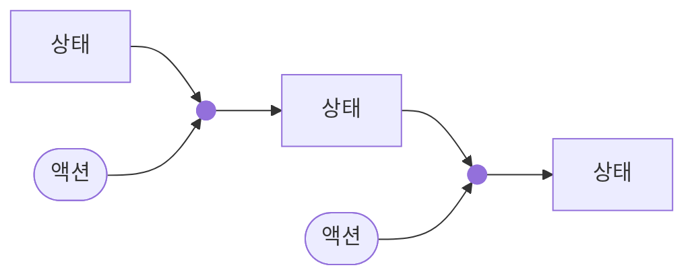
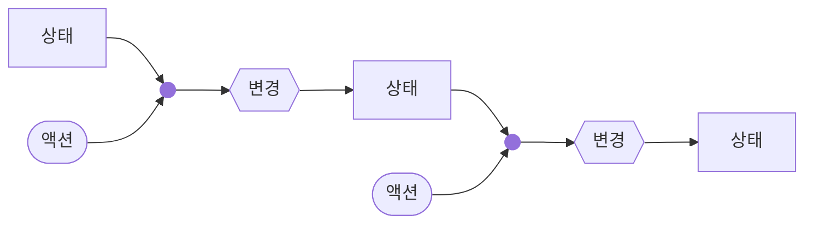
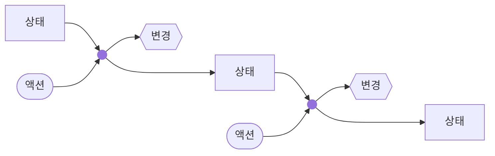
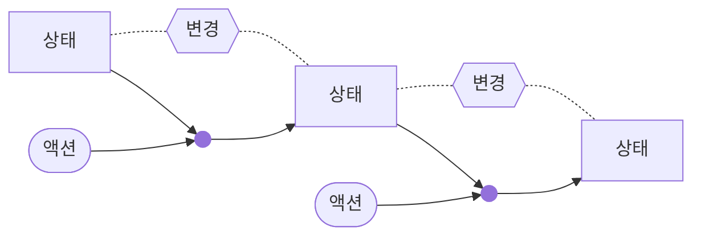

### 기본 단위
#### 액션
게임은 액션의 수행을 단위로 진행된다. 한 액션의 수행으로 인한 총 변경은 절대로 분리할 수 없고, 상태와 액션의 조합의 결과는 결정적이다.
#### 상태
상태는 게임의 상황을 표현한다. 상태는 언제든지 재시작가능한 표현식이며, 액션과 액션 사이의 정지된 상황을 표현한다.
#### 단위 변경
단위 변경은 게임 상태의 변화를 사용자에게 나타내기 위한 최소 단위이다. 단위 변경은 순서를 가질수도 있고, 병렬적으로 병합하여 표현할 수도 있으나, 어떠한 형태든 사용자에게 상태의 변화를 전달하기 위한 목적으로 정의해야 한다.
### 단위의 관계
상태와 액션의 관계는 아래와 같다.

단위 변경을 도출하는 방식은 다양한 형태가 있을 수 있다.

상태와 액션의 조합으로부터 변경을 도출한 뒤 변경을 통해 다음 상태를 도출한다면, 상태와 변경의 관계의 정합성이 항상 보장되지만 뷰를 표현하기 위해 설계된 변경이 비즈니스 로직을 주도한다는 문제가 발생한다.

상태와 액션의 조합으로부터 상태와 변경을 별도로 도출해낸다면, 뷰 모델이 논리적인 상태와 완전히 분리된다는 장점이 있으나 변경과 상태의 정합성을 보장할 수 없다는 점과 액션의 결과를 표현하는 방식이 이원화 된다는 문제가 발생한다.

상태는 액션의 직접적인 결과로 도출하되 상태의 변화로부터 변경을 추론한다면, 변경의 순서, 단위성, 원인 등을 제대로 추론하기 어렵다는 문제가 발생한다.